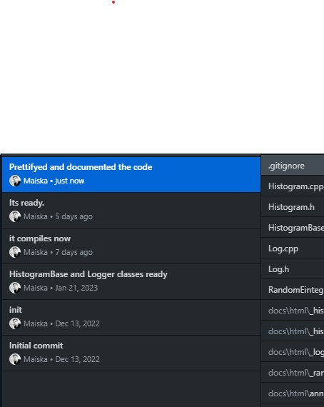

# histogramApplication

Keeps track of values and their occurrences


## Documentation

[Documentation](https://maiska123.github.io/histogramApplication/)


## Run Locally

at project root 

### debug
```bash
make BUILD=debug
```

### release
```bash
make 
```

defaults to c++17. 


## Usage/Examples

param 1 = iteration count (how many random values): INT

param 2 = statistics: 1/0 

param 3 = output all values and occurrences: 1/0

```bash
.\histogramApplication 10 1 1
```

output:
```bash

Histogram maxValue: 3
Histogram minValue: 0
Histogram mode: 1
All Values:
        key: 3 amount: 3
        key: 1 amount: 4
        key: 2 amount: 1
        key: 0 amount: 2

```

if one asking:

